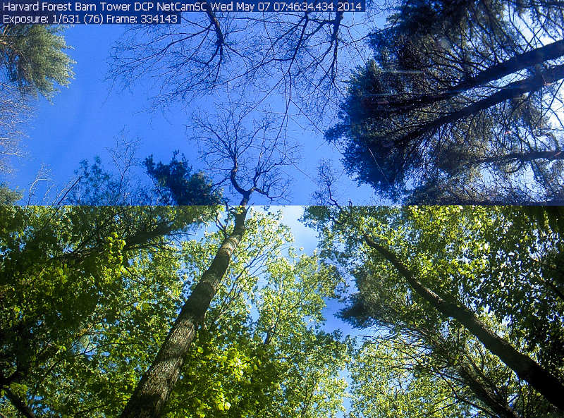
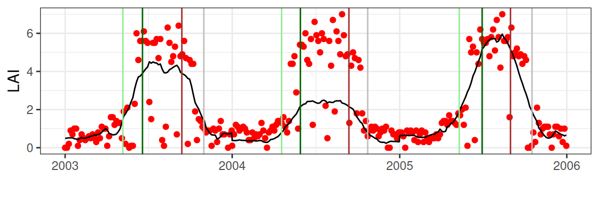
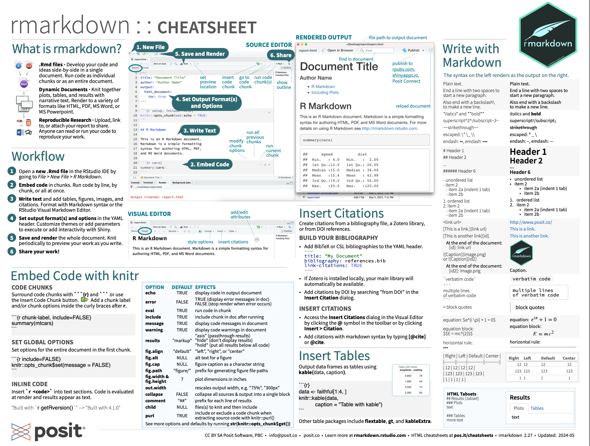
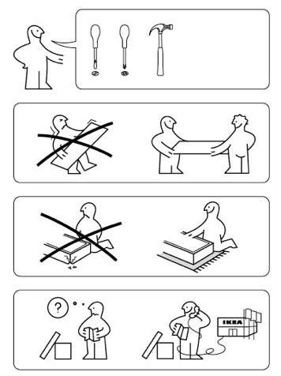

```{r setup, include=FALSE}
knitr::opts_chunk$set(echo = TRUE)
```

## Phenology
```{r}
#| label: fig-canopy-change
#| fig-cap: "Split image of canopy change between winter and spring/summer at Harvard Forest, Petersham, MA, USA"
#| fig-align: "center"
#| out-height: "100%"
#| echo: FALSE

```


## Phenology algorithms
```{r}
#| label: fig-canopy-LAI-phenology-detection
#| fig-cap: "Sesonal evolution of leaf area index (LAI) and detected phenology"
#| fig-align: "center"
#| out-width: "80%"
#| echo: FALSE

```


## Module 6 - Phenology trends and algorithms

- course material at: https://fabern.github.io/handfull_of_pixels/
  - additional content & exercises: <br>https://geco-bern.github.io/handfull_of_pixels/
- exercises: chapter 7.1 Phenology trends and algorithms
- exercise: work alone or in teams of two
- hand-in: **by June 5th, 2025** (in ILIAS)
- hand-in: as a zip file containing a reproducible copy of your R project folder
  - Rmd files with your analysis and responses to the exercise questions
  - as well as rendered ("knitted") html-files of your Rmd-files
  - including other data and source code (if needed)


## Module 6 - These sessions (15/22.05.2025)

  - R and R markdown based
  - all accessible / when reading the chapters in class + brief intro
  - here to teach, not to grade

## Online material


```{r eval = FALSE}
https://fabern.github.io/handfull_of_pixels/
```

  - 1 Crash course R
  - 2 Accessing data
  - 3 Geospatial data in R
  - 4 Phenology trends
  - 5 Phenology algorithms
  - (6 Phenology modelling)
  - (7 Landcover classification)
  - 8 Exercises
  
  
## Spatial processing in R

- World is data rich
- Finding the right data is key
- Objectives
  - Finding and using data
  - Getting data
  - Spatial processing in R


## Finding & using data {.emphasized}

- Identify how to **get the data**
- Understand the format (extension)
- **Confirm the format**
  - meta-data
  - headers

## Getting data {.emphasized}

- Direct downloads
  - manually
  - not always structured
- Application Programming Interfaces (APIs)
  - automatic
  
```{r eval=FALSE}
library("MODISTools") # load the library for use in this script

products <- MODISTools::mt_products() # list all available products

data <- MODISTools::mt_subset(product = "MOD11A2", ...) # download one data product
```


## Spatial processing in R {.emphasized}

- Focus on two main tools
- raster data `terra`
- vector data `sf`

Only raster data processing will be discussed in depth.

## Spatial processing in R: package setup

```{r eval = FALSE}
# Installing the required packages
# (additional software modules)
install.packages("terra")
install.packages("sf")
install.packages("dplyr")
install.packages("ggplot2")
install.packages("patchwork")
...
install.packages("MODISTools")
```

- already done for you
- on personal laptop: see https://fabern.github.io/handfull_of_pixels/appendix_setup.html
  - for Geoprocessing-III you don't need last block of packages <br>(`phenocamr` to `xgboos`)


## Spatial processing in R: the basics {.emphasized}

```{r eval=TRUE, message=FALSE, warning=FALSE}
# load the library
library("terra")
filepath <- system.file("ex/elev.tif", package="terra")
elev <- terra::rast(filepath)

# show the resulting object
elev
```


## Crash course R/RStudio

<div class="columns-2">

  

  - RStudio based (Integrated Development Environment)
  - code heavy (focus on automation / computation)
  - parallels with python
</div>

## R markdown

<div>

</div>

## R markdown

<div>

</div>

## R markdown

<div class="centered">

</div>

## 

<div class="centered">
https://rmarkdown.rstudio.com/
</div>

<div class="centered">
Cheat sheet: https://github.com/rstudio/cheatsheets/raw/main/rmarkdown.pdf
</div>

<div class="centered">

</div>

## Reporting

<div class="columns-2">
  

  - Read the documentation/course
  - Motivate the use of particular data and or methods
  - Make notes on potential limitations
  - Report in Rmarkdown (rendered html)
  - Ask for help during the sessions
</div>


## Spatial processing in R: project setup {.emphasized}

```{r eval = FALSE}
# Download the project zip file
https://github.com/geco-bern/R_proj_template/archive/refs/heads/main.zip
```

- Download and unzip the file
- Rename and open the Rproj file (opens RStudio)
- Place downloaded data in `data/`
- Place R markdown scripts for report in `vignettes/`
- (if needed) place e.g. copy-pasted R code from tutorial in `analysis/trying_out.R`
- Let's get started: https://fabern.github.io/handfull_of_pixels/


## Spatial processing in R: package setup (fixing missing admin rights) {.emphasized}

```{r eval = FALSE}
# Installing the required packages
install.packages("terra")
# ....
install.packages("here")
# This does not work on lab computers, since you do not have the rights. 
# In that case, you must install packages into a personal folder. (see below)
```


```{r eval = FALSE}
# Setup your personal package library (needs to be done in each session again)
.libPaths()
# [1] "C:/Program Files/R/R-4.5.0/library"

dir.create("C:\\Users\\fb24k097\\Documents\\R2")      # create a folder
.libPaths(new = "C:\\Users\\fb24k097\\Documents\\R")  # set the personal folder
.libPaths()
# [1] "C:/Users/fb24k097/Documents/R"     
# [2] "C:/Program Files/R/R-4.5.0/library"

```
